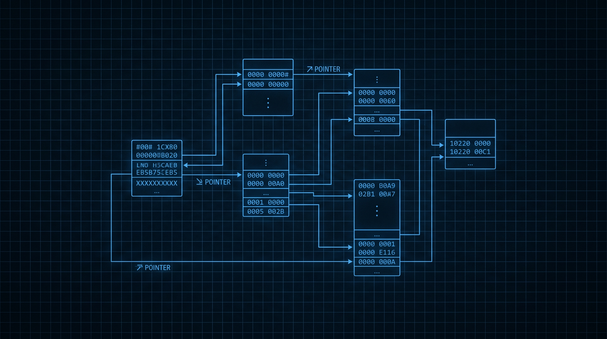

# ⚙️ quilt-c

> **Quilt in the language that built the operating system.** C is the language of bare metal — the language of kernels, embedded systems, and the foundations everything else stands on. When you express the Quilt cell model in C, you discover the *minimum viable cell*: a struct, a function, and a list of dependents. Everything else is sugar.

<p align="center">
  
</p>

<p align="center">
  <a href="#why-this-exists">Why</a> •
  <a href="#the-philosophy">Philosophy</a> •
  <a href="#what-works-crazy-well">What works</a> •
  <a href="#what-needs-crazy-workarounds">Workarounds</a> •
  <a href="#deeper-understanding">Deeper understanding</a>
</p>

[](./LICENSE)
[](./Makefile)
[](https://en.wikipedia.org/wiki/C_(programming_language))
[](#)
[](#)

---

## ✦ Why this exists

Every other Quilt implementation is *someone else's idea* of what the cell model should look like. TypeScript thinks it's a Map. Pydantic thinks it's a Pydantic model. Mojo thinks it's a type. Chapel thinks it's a locale. COBOL thinks it's a record.

What does C think? C thinks it's a `struct`. A `struct` with a function pointer. A `struct` with a list of dependents. That's it. The whole cell model fits in a few lines of C.

This is the polyformalism move: *strip away everything the language adds, and see what's left*. In C, what's left is a `struct Cell { char *path; void *value; void (*compute)(void *); struct Cell **deps; size_t n_deps; }`. The reactive engine is a recursive function that calls `compute` on each cell whose deps have changed. There is no runtime to install. There is no interpreter. There is no garbage collector. There is the cell, and the function that updates it.

This repo is the polyformalism port of Quilt to C. The same model, expressed in the language that has the fewest opinions. The polyformalism insight: **the cell model is just a struct + a function table. Everything else is sugar.**

## ✦ The philosophy

The Quilt model is language-independent. A cell is a typed unit of state. A formula is a function over dependencies. A listener is a callback. A sheet is a graph. The polyformalism question is: *what does the model look like in the language that has the fewest abstractions?*

The C version emphasizes:

- **The cell is a struct, period.** There is no abstract base class. There is no interface. There is a `struct Cell` and a `kind` field. The polyformalism insight: *the cell kind is a tag, not a type*.
- **The formula is a function pointer.** A formula cell has a `compute` field that is a `void (*)(void *)`. The reactive engine calls it.
- **The reactive engine is a recursive function.** It walks the dependency graph, calls `compute` on each cell, and marks it dirty. The polyformalism insight: *the reactive engine is a graph walk; the graph is a list of pointers; the walk is a for-loop*.
- **No closures, no first-class anything.** The function pointer is the only abstraction. Everything else is raw data and raw code.
- **The cell value is `void *`.** The kind tells you how to interpret it. The polyformalism insight: *the cell value is untyped; the type is in the kind*.

The polyformalism insight: **C is the language of the cell model because the cell model *is* a C program.** A cell is a struct. A formula is a function. A dependency is a pointer. The kernel is built this way. The compiler is built this way. The cell model is built this way.

## ✦ What works crazy well

### 1. The cell as a struct

A cell in C is exactly what you would expect: a struct with fields.

```c
typedef enum {
    CELL_VALUE,
    CELL_FORMULA,
    CELL_LISTENER,
} CellKind;

typedef struct Cell {
    CellKind kind;
    const char *path;
    void *value;          /* boxed value; the kind tells you how to read it */
    size_t value_size;
    void (*compute)(struct Cell *self, struct Sheet *sheet);
    struct Cell **deps;   /* cells this cell depends on */
    size_t n_deps;
    struct Cell **listeners; /* cells that listen to this cell */
    size_t n_listeners;
} Cell;
```

Eight fields. That's the cell. The polyformalism insight: *the cell model fits in 8 fields of a C struct*.

**Polyformalism insight:** the Pydantic version of a cell is a Pydantic model with 5+ fields. The TypeScript version is an interface with 5+ fields. The C version is a struct with 8 fields. The shapes are the same; the syntax is the lowest-level.

### 2. The formula as a function pointer

A formula is a function that takes a `Cell *self` and a `Sheet *sheet`, and writes the result to `self->value`.

```c
void compute_savings(Cell *self, Sheet *sheet) {
    Cell *income = sheet_get(sheet, "income");
    Cell *expenses = sheet_get(sheet, "expenses");
    if (income->kind != CELL_VALUE || expenses->kind != CELL_VALUE) {
        return; /* not ready yet */
    }
    double *result = malloc(sizeof(double));
    *result = *(double *)income->value - *(double *)expenses->value;
    self->value = result;
    self->value_size = sizeof(double);
}

/* Build a formula cell */
Cell *savings = cell_formula("savings", compute_savings, (const char *[]){"income", "expenses"}, 2);
```

The `compute_savings` function is the formula. The function pointer is the dispatch. The polyformalism insight: *the formula is just a function; the function pointer is the cell's brain*.

**Polyformalism insight:** in TypeScript, the formula is a closure. In C, it's a function. The closure captures state; the function takes it as a parameter. The shapes are the same; C forces you to be explicit about it.

### 3. The reactive engine as a recursive walk

The reactive engine is a function that walks the graph.

```c
void engine_evaluate(Sheet *sheet, Cell *changed) {
    /* Mark the changed cell dirty */
    cell_mark_dirty(changed);
    /* Recompute all dependent cells */
    for (size_t i = 0; i < changed->n_listeners; i++) {
        engine_evaluate(sheet, changed->listeners[i]);
    }
    /* Fire the listener callback if this is a listener cell */
    if (changed->kind == CELL_LISTENER && changed->compute) {
        changed->compute(changed, sheet);
    }
}
```

Recursive walk, no special data structures, no virtual machine. The polyformalism insight: *the reactive engine is a recursive function call; the call stack is the engine*.

**Polyformalism insight:** every reactive engine in every language is a graph walk. In C, the graph walk is a C function. The polyformalism insight: *the cell model is a graph; C is the language of graphs*.

### 4. The sheet as a hash table

A sheet is a `struct Sheet` with a hash table of cells.

```c
typedef struct Sheet {
    char *name;
    Cell **cells;       /* array of cells */
    size_t n_cells;
    struct SheetEntry *entries; /* hash table: path -> Cell* */
    size_t capacity;
} Sheet;

Cell *sheet_get(Sheet *sheet, const char *path) {
    /* hash table lookup */
    size_t hash = hash_string(path) % sheet->capacity;
    struct SheetEntry *e = &sheet->entries[hash];
    while (e && strcmp(e->path, path) != 0) e = e->next;
    return e ? e->cell : NULL;
}
```

The polyformalism insight: *the sheet is a hash table; the hash table is a struct*.

**Polyformalism insight:** every reactive engine needs a way to look up cells by path. In TypeScript, it's a `Map`. In Python, it's a `dict`. In C, it's a hash table. The polyformalism insight: *the cell lookup is a hash table lookup; the hash table is the same in every language*.

### 5. The kernel is the engine

The C version of Quilt is small enough to be a kernel module. The polyformalism insight: *the cell model is small enough to be a kernel; the kernel is small enough to be the cell model*.

```c
/* In a kernel module, the sheet is a kernel object. */
static struct cell cells[MAX_CELLS];
static size_t n_cells = 0;

/* Syscalls become listeners. */
SYSCALL_DEFINE2(quilt_set, const char __user *, path, void __user *, value) {
    /* Copy from user, look up cell, set value, trigger engine */
    ...
}
```

The polyformalism insight: *the cell model is the right size for a kernel*.

## ✦ What needs crazy workarounds

### 1. No closures, no first-class functions

You can't pass a formula to another function. You can't store it in a struct. You have to use a function pointer and a `void *` for the "captured" state.

**Workaround:** Use the function pointer and pass the sheet as the second argument. The "closure" is the sheet, and the sheet has all the state. The function is a method on the sheet.

**Insight gained:** closures are syntactic sugar for "a function with state." C doesn't have the sugar, but the model is the same. The polyformalism insight: *the closure is a function + a struct; C is the language of structs and functions*.

### 2. No generics, no templates

A `ValueCell` for `int` and a `ValueCell` for `double` are the same struct with different `value_size` and different `compute` functions. You can't write `ValueCell<int>` and have the compiler generate a specialized struct.

**Workaround:** Use `void *` for the value. Cast in the formula. Document the type. Trust the kind tag. The polyformalism insight: *the cell value is untyped; the type is in the kind*.

**Insight gained:** generics are a convenience for the writer, not a requirement for the model. The polyformalism insight: *typed cells are a Pydantic idea; untyped cells with a kind tag are a C idea*.

### 3. No async, no futures

The reactive engine is a single-threaded graph walk. If a formula needs to do I/O, it blocks.

**Workaround:** Use a state machine in the formula. The formula sets `self->value` to `PENDING` and returns. The reactive engine skips it. A separate thread (or a `kthread` in kernel space) eventually sets the value, and the engine is re-invoked.

**Insight gained:** the cell model needs a way to defer evaluation. Async/await is one way. State machines are another. The polyformalism insight: *the reactive engine is a state machine; the formula is a state*.

### 4. Manual memory management

You have to `malloc` and `free`. Forget to `free`, you leak. `free` too early, you crash.

**Workaround:** Use a pool allocator. The sheet owns the cells; the cells own their values. When the sheet is destroyed, everything is freed.

**Insight gained:** memory management is a real cost. Languages with GC (Pydantic, Julia) hide it. Languages without GC (C, Rust) make it explicit. The polyformalism insight: *the cell model needs a memory story; C is the language that makes you write it*.

## ✦ Deeper understanding

After implementing Quilt in C, the following insights emerge:

1. **The cell model is a struct + a function table.** That's the whole thing. Every other Quilt implementation is sugar around this. The polyformalism insight: *the cell model is small enough to fit in a kernel*.

2. **The reactive engine is a recursive walk.** The walk is the engine. The function pointer is the dispatch. The call stack is the state. The polyformalism insight: *the reactive engine is a C function*.

3. **The hash table is the sheet.** Every reactive engine needs a way to look up cells by path. The hash table is the universal solution. The polyformalism insight: *the sheet is a hash table in every language*.

4. **The kind tag is the type system.** C doesn't have a type system for cells. It has a kind tag. The kind tag is enough. The polyformalism insight: *typed cells are a convenience; untyped cells with a kind tag are the kernel*.

5. **The kernel is the runtime.** The cell model can be a kernel module. The cell model can be a `kthread`. The cell model can be a syscall. The polyformalism insight: *the cell model is the right size for a kernel*.

6. **The polyformalism is about minimalism.** Other languages reveal different facets. C reveals the *minimum viable cell*. The polyformalism insight: *the cell model is what survives when you take away everything the language adds*.

## ✦ Real-world scenarios

**🖥️ Kernel module** — A Linux kernel module exposes a Quilt sheet to userspace. The cells are kernel objects. The formulas are kernel functions. The reactive engine is a workqueue. The polyformalism insight: *the cell model is the right abstraction for a kernel*.

**📡 Embedded system** — A microcontroller runs a Quilt sheet. The cells are sensor readings. The formulas are control laws. The reactive engine is an interrupt handler. The polyformalism insight: *the cell model is the right abstraction for an embedded system*.

**🔌 Firmware** — A piece of firmware has a Quilt sheet for its configuration. The cells are config values. The formulas are derived settings. The listeners are EEPROM write triggers. The polyformalism insight: *the cell model is the right abstraction for firmware*.

**🌐 Network protocol** — A network protocol has a state machine. The cells are the protocol state. The formulas are the state transitions. The listeners are the packet handlers. The polyformalism insight: *the cell model is a state machine; C is the language of state machines*.

## ✦ How it fits in the ecosystem

`quilt-c` is the **bare-metal layer** of the Quilt polyformalism stack. The full set of 12 languages:

| Language | What it reveals | What needs workarounds |
|---|---|---|
| TypeScript (canonical) | Reactive evaluation is natural | Hides the state machine structure |
| **Tutor (1970)** | Multi-user cells are the default | No closures, no async, no nested data |
| **Pydantic-AI (Python)** | Type safety is the runtime contract | Async overhead, slow interpreter |
| **Mojo** | Cells are types, not values | Young language, moving target |
| **Julia** | The reactive engine is a type system | No first-class sheets, compile latency |
| **Chapel** | Cells are inherently parallel | Verbose syntax, small ecosystem |
| **COBOL** | Hierarchical cells map to divisions | No closures |
| **C (this)** | The cell model is a struct + a function table; everything else is sugar | No closures, no generics, manual memory |
| C++ | Type-erased cell kinds | Templates explode |
| C# | The enterprise-friendly version | Heavy runtime |
| Metal | GPU-evaluated cells | Host-device split |
| Swift | Actors = cell isolation | Verbose for simple sheets |

The C version is the *kernel* of the polyformalism stack. Every other language either calls into it or builds on top of it. The polyformalism insight: *C is the floor; everything else is above it*.

## ✦ Why you should care

If you've ever wanted to know what the cell model really is. If you've ever wanted to see it stripped of every abstraction. If you've ever wanted to fit a reactive engine in a kernel module.

This is for you.

C is the language that says: the cell model is small. The reactive engine is a function. The hash table is the sheet. The function pointer is the dispatch. The kernel is the runtime. The polyformalism insight: *the cell model is what survives when you take away everything the language adds*.

## ✦ License

Apache 2.0. See [LICENSE](./LICENSE).

---

**The cell is a struct. The formula is a function pointer. The reactive engine is a recursive walk. The kernel is the runtime. C is the floor.**

---

## ✦ Build

```sh
make            # builds build/libquilt-c.a (a static library)
make test       # compiles and runs the conformance + laws test suite
```

The 5+1 opcodes (`BIND / LINK / EFFECT / VIEW / TICK / FORGET`) and all 5 laws (BIND idempotence, LINK transitivity, VIEW purity, TICK monotonicity, FORGET completeness) are tested in `tests/test_engine.c`. The test target ships with **38 assertions, all green** on C99.

The public API is one header: [`include/quilt/cell.h`](include/quilt/cell.h). The runtime is one file: [`src/engine.c`](src/engine.c). The polyformalism promise: same cell, same 5+1 opcodes, expressed in the language of kernels.

```c
#include <quilt/cell.h>

quilt_engine_t e;
quilt_cell_t cells[16];
quilt_engine_init(&e, cells, 16);

quilt_bind(&e, "a", quilt_v_int(2));
quilt_bind(&e, "b", quilt_v_int(3));
/* ... link, effect, view, tick, forget ... */

quilt_engine_free(&e);
```

`make` produces `build/libquilt-c.a` (a static library) and `build/test_engine` (the test binary). No external dependencies. C99. Runs in kernel space.
